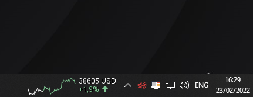

# Crypto Addon
Bitcoin live ticker with graph (24h) for the Windows taskbar!<br>
Crypto data source: [api.blockchain.info](https://api.blockchain.info)



## Installation
This addon requires the core application [DesktopModules](https://github.com/LabyStudio/desktopmodules)

You can download the addon jar file [here](https://github.com/LabyStudio/crypto-addon/releases/) <br>
Put the built jar file into the following directory: ``C:/Users/<name>/AppData/Roaming/DesktopModules/addons/``<br>
And then you are ready to launch the core application.

## Configuration

You can change the currency in the config:
```json
{
  "modules": {
    "cryptomodule": {
      "enabled": false,
      "x": 1526,
      "y": 5,
      "currency": {
        "base": "BTC",
        "quota": "EUR"
      }
    }
  }
}
```

## Run in IDE
Launch the main class ``StartCrypto``